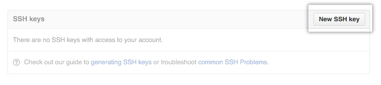

# Setting Up Git Repositories


## Purpose
Setup GIT repositories and access on the **Master**.


## Create a repo within the GitHub Classroom:

1. Browse to [github.com](https://www.github.com) and create a GitHub account if you do not already have one. It is useful if your username is something that identifies you (e.g., bneff1013).
1. **One student per group** do the following on your personal computer:
    1. First we are going to setup the repo for the Master.  This will allow your instructor to see all of your commits throughout the semester.
    1. Browse to [https://classroom.github.com/a/OoH0u_XW](https://classroom.github.com/a/OoH0u_XW)
    1. Select "Accept this assignment"
    1. You may need to hit refresh, but eventually it will provide you a link to the repository.
	1. Browse to your repository.
	1. Note the url for your repository (save this link, it is the best way to check if your repo is updated).
	1. Go to Settings -> Manage access -> and "Invite teams or people".
	1. Provide access to your team member using their GitHub user name.
    1. Now we need to do the exact same thing to setup the repo for the robot.
	1. Browse to [https://classroom.github.com/a/0MPq4TNE](https://classroom.github.com/a/0MPq4TNE) and repeat steps c-h.


## Enable SSH connection to your GitHub account
1. Open a terminal on your **Master** (ctrl+alt+t).
1. The same student as step 1.1.2 do the following:
    1. Generate a new SSH key, substituting your GitHub email address:
        ```bash
        ssh-keygen -t ed25519 -C "your_email@example.com"
        ```
	1. When you're prompted to "Enter a file in which to save the key," click enter.
	1. At the prompt, type a secure passphrase.
	1. Start the ssh-agent in the background and add your SSH private key to the ssh-agent:
        ```bash
        eval "$(ssh-agent -s)"
        ssh-add ~/.ssh/id_ed25519
        ```
	1. Open the public key:
        ```bash
        nano ~/.ssh/id_ed25519.pub
        ```
	1. Select the contents of the file (maximize the window and ensure it has your GIT email at the end), right click, and select copy.
    1. Open a web browser and sign in to your GitHub account.
	1. In the upper-right corner of any page, click your profile photo, then click **Settings**.
        
	1. In the user settings sidebar, click **SSH and GPG keys**.
		
    1. Click **New SSH key**
		
	1. In the "Title" field, add a descriptive label for the new key, such as "MasterX".
	1. Paste your key into the "Key" field (contents of the `.pub` file).
	1. Click **Add SSH key**.
	1. If prompted, confirm your GitHub password.
    1. Create a secure shell connection to your **Robot** (password is dfec3141)
        ```bash
        ssh pi@robotX
        ```
    1. Repeat steps a-f on your **Robot** and j-n on your **Master**.


## Clone repository to your master.
1. On the **Master**, open the GitHub repository and copy your repo address using the SSH mode:
	
1. Open a terminal and browse to your workspace source folder:
    ```bash
    cd ~/master_ws/src/
    ```
1. Clone your repo using the username and password used when you generated the SSH key, replacing **USERNAME** with your GitHub username:
    ```bash
    git clone git@github.com:ECE387/ece387_master_spring202X-USERNAME.git
    ```

1. Update your git email address and the last name for you and your team mate.
    ```bash
    git config --global user.email "you@example.com"
    git config --global user.name "Lastname1 Lastname2"
    ```


## Clone repository to your robot.
1. Create a secure shell connection to your robot:
    ```bash
    ssh pi@robotX
    ```
1. Ensure you are in the ROS robot workspace src directory.
    ```bash
    cd robot_ws/src
    ```
1. Clone the robot repository:
    ```bash
    git clone git@github.com:ECE387/ece387_robot_spring202X-USERNAME.git
    ```
1. Update your git email address and the last name for you and your team mate.
    ```bash
    git config --global user.email "you@example.com"
    git config --global user.name "Lastname1 Lastname2"
    ```
