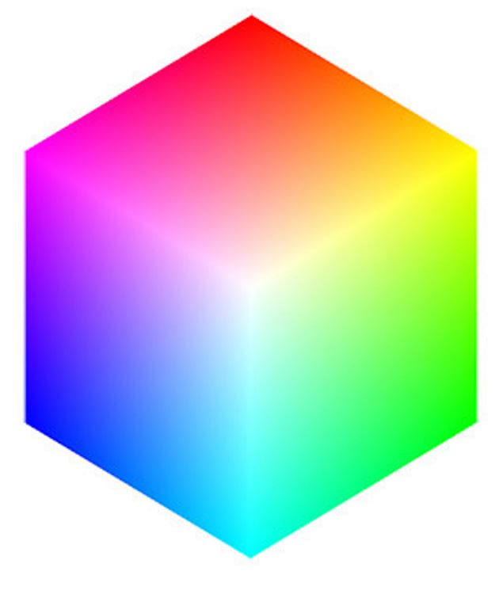

# Module 9: Computer Vision

## Part 1: Image Basics
When we talk about the sizes of images, we generally talk about them in terms of the number of pixels the image possesses in the x(horizontal) or y(vertical) direction.  If the image is a color image, we also need to concern ourselves with the depth of the image as well.  Normally, each individual pixel is represented by the “color” or the “intensity” of light that appears in a given place in our image.

If we think of an image as a grid, each square in the grid contains a single pixel.

Most pixels are represented in two ways: grayscale and color. In a grayscale image, each pixel has a value between 0 and 255, where zero is corresponds to “black” and 255 being “white”. The values in between 0 and 255 are varying shades of gray, where values closer to 0 are darker and values closer 255 are lighter:

The grayscale gradient image in the figure above demonstrates darker pixels on the left-hand side and progressively lighter pixels on the right-hand side.

Color pixels, however, are normally represented in the RGB color space (this is where the term color-depth comes from)— one value for the Red component, one for Green, and one for Blue, leading to a total of 3 values per pixel:

Other color spaces exist, and ordering of the colors may differ as well, but let’s start with the common RGB system.  If we say the image is a 24-bit image, each of the three Red, Green, and Blue colors are represented by an integer in the range 0 to 255 (8-bits), which indicates how “much” of the color there is. Given that the pixel value only needs to be in the range [0, 255] we normally use an 8-bit unsigned integer to represent each color intensity.  We then combine these values into a RGB tuple in the form (red, green, blue) . This tuple represents our color.  For example:

- To construct a white color, we would fill each of the red, green, and blue buckets completely up, like this: (255, 255, 255) — since white is the presence of all color.
- Then, to create a black color, we would empty each of the buckets out: (0, 0, 0) — since black is the absence of color.
- To create a pure red color, we would fill up the red bucket (and only the red bucket) up completely: (255, 0, 0) .
- etc

Take a look at the following image to make this concept more clear:

For your reference, here are some common colors represented as RGB tuples:

- Black:  (0, 0, 0)
- White:  (255, 255, 255)
- Red:  (255, 0, 0)
- Green:  (0, 255, 0)
- Blue:  (0, 0, 255)
- Aqua:  (0, 255, 255)
- Fuchsia:  (255, 0, 255)
- Maroon:  (128, 0, 0)
- Navy:  (0, 0, 128)
- Olive:  (128, 128, 0)
- Purple:  (128, 0, 128)
- Teal:  (0, 128, 128)
- Yellow:  (255, 255, 0)