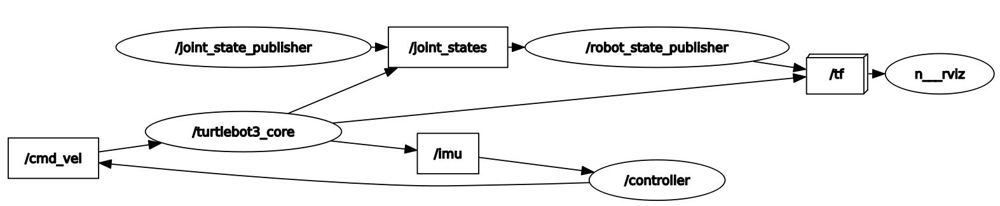

# Launch Files

## Purpose
Large applications in robotics typically involve several interconnected ROS nodes, each of which have many parameters. Your current setup is a good example: as you experienced in the IMU lab, you had to open 3 different terminals to run all of the nodes necessary for our system to that point:

**Robot:**
- turtlebot3_core.launch

**Master:**
- roscore
- lab2/turtlebot_controller.py

This problem is only going to get more complex as we add additional functionality to our robot. As it stands right now, every node requires a separate terminal window and the associated command to run it. Using the *roslaunch* tool, we can eliminate that administrivia of running each node separately. We will create/edit two launch files to bring up the nodes on the master and robot.

## [roslaunch](http://wiki.ros.org/roslaunch)
The *roslaunch* tool is used to launch multiple ROS nodes locally and remotely via SSH. We can run nodes that we have created, nodes from pre-built packages, and other launch files. The roslaunch tool takes in one or more XML configuration files (with the .launch extension) that specify the parameters to set and nodes to launch.

A launch file is an XML document which specifies:
- which nodes to execute
- their parameters
- what other files to include

An XML file stands for Extensible Markup Language (XML). This is a markup language that defines a set of rules for encoding documents in a format that is both human-readable and machine-readable. That isn't necessarily important for this class, but you can read about XML on Wikipedia if you are interested.

We will then use a tool embedded within ROS called *roslaunch* to easily launch multiple nodes or even other launch files.

By convention, we will give our launch files the *.launch* extension and store them in a *launch* folder within our package. This isn't required, but it is the common convention.

## Current State
In this section we will first use the conventional technique to bring up all of the nodes required for **Lab 2** using the currently understood techniques.

Open a new terminal on your **Master** and start *roscore*:

```bash
roscore
```

Notice, running **roscore** now monopolized that terminal and you can no longer use it for anything else.

Open a new terminal or tab on your **Master** and run the **controller.py** node:

```bash
rosrun lab2 turtlebot_controller.py
```

At this point we are done with the master. We only needed to bring up two terminals, however, this is still a relatively simple system in teh grand scheme of things.

> 📝️ **Note:** We did need to keep the terminal with the **turtlebot_controller.py** node open so we can enter commands.

We can now transition to the robot and bring up the required nodes.

Open a new terminal window on the **Master** and use SSH to create a secure shell into the **Robot**:

```bash
ssh pi@robotX
```

Utilize the SSH instance to start the **turtlebot3_core** launch file:

```bash
roslaunch turtlebot3_bringup turtlebot3_core.launch
```

Overall you needed 3 terminal windows, including one SSH connection, to bring up this relatively simple system of sensors.

Kill all nodes and roscore.

## roslaunch on the Robot
Navigate to one of the terminals with a secure shell connection to the robot.

Open the *turtlebot3_core.launch* file:

```bash
rosed turtlebot3_bringup turtlebot3_core.launch
```

At this time, the *turtlebot3_core.launch* file includes everything you need to run the robot's core functionality (driving and reading data from the IMU). Let's talk about each line of the file:

The XML declaration <?xml version="1.0"?> is typically included at the beginning of an XML file to indicate the version of XML being used (in this case, version 1.0). However, when writing ROS (Robot Operating System) launch files in XML format, you generally do not need to include this declaration.

ROS launch files typically have a specific structure and do not require the XML version declaration. Instead, a ROS launch file typically starts with the <launch> tag. For example:

```xml
<launch>
    <!-- Your ROS launch file content goes here -->
</launch>
```

In ROS launch files, the <launch> tag serves as the root element for defining various nodes, parameters, and other configurations. Therefore, every launch file opens and closes with the *launch* root element.

```xml
<launch>
    <node pkg="rosserial_python" type="serial_node.py" name="turtlebot3_core" output="screen">
        <param name="port" value="/dev/ttyACM0"/>
        <param name="baud" value="115200"/>
        <param name="tf_prefix" value="$(arg multi_robot_name)"/>
    </node>
</launch>
```

The above establishes the node to create a serial connection to the Turtlebot3. We can see a few parameters were set, `port` and `baud`, to help in establishing the connection.

Close the editor: `ctrl+x`


## roslaunch on the Master
Navigate to your **lab2** package on the **Master** and create a launch directory:

```bash
roscd lab2
mkdir launch
cd launch
touch lab2.launch
```

Open the launch file to edit (I recommend using **sublime**).

Now we are going to edit the launch file to bring up all of the nodes (both on the **Master** locally and remotely on the **Robot**)

> 📝️ **Note:** *roslaunch* will look to see if *roscore* is started. If it is not, it will automatically run *roscore*.

Add the following to the **lab2.launch** file

```xml
<launch>
  <!-- Bring up all local nodes first -->
    
  <!-- model to visualize the Turtlebot3 in RVIZ -->
  <include file="$(find turtlebot3_bringup)/launch/turtlebot3_model.launch"/>

  <!-- controller to rotate the robot --> 
  <node
    name="controller" pkg="lab2" type="turtlebot_controller.py"
    output="screen" launch-prefix="xterm -e"
  />

  <!-- remote nodes -->
  <machine
    name="robot0"
    address="robot0"
    env-loader="/home/pi/robot_ws/devel/remote_env_loader.sh"
    default="true"
    user="pi"
  />

  <!-- core functionality of the Turtlebot3 -->
  <node machine="robot0" pkg="rosserial_python" type="serial_node.py" name="turtlebot3_core" output="screen">
    <param name="port" value="/dev/ttyACM0"/>
    <param name="baud" value="115200"/>
  </node>

</launch>

```

> 📝️ **Note:** Remember earlier how we reminded you that we need to keep the terminal available for the controller to type commands. By using the two additional parameters *screen* and *launch-prefix*, we can ensure the terminal is available for use.

Save and close the launch file.

## Setting up remote connectivity
Before we can run the above launch file we need to accomplish some steps to ensure we can connect remotely to our **Robot**.

1. Open a terminal on your **Master** and type the following:

    ```bash
    ssh -oHostKeyAlgorithms='ssh-rsa' pi@robotX
    ```

1. Type `yes` and press **Enter**.

1. When prompted, type in the password for the pi user on the robot.

1. Type `exit`.

1. On the **Master** type the following to create private and public keys:

    ```bash
    ssh-keygen -t rsa
    ```

1. Press **Enter**

1. Press **Enter** twice more for *no passphrase**

1. On the **Master** send the public key to the **Robot**

    ```bash
    ssh-copy-id pi@robotX
    ```

1. Test that you can now create an SSH connection to the **Robot** without having to enter a password.

1. In your secure shell to the **Robot** create a remote ROS environment shell script file:

    ```bash
    cd robot_ws/devel/
    nano remote_env_loader.sh
    ```

1. Copy the following environmental variables into the file:

    ```bash
    #!/bin/bash

    source /opt/ros/noetic/setup.bash
    source ~/robot_ws/devel/setup.bash
    export ROS_PACKAGE_PATH=~/robot_ws/src:/opt/ros/noetic/share
    export ROS_HOSTNAME=`hostname`
    export ROS_MASTER_URI=http://masterX:11311
    export EDITOR='nano -w'
    export HOSTNAME=`hostname`
    export TURTLEBOT3_MODEL=burger
    export LDS_MODEL=LDS-01

    exec "$@"
    ```

    > 📝️ **Note:** These are the same environmental variables we have inserted to our `.bashrc` files on the **Master** and **Robot**. When we run nodes remotely on a system the `remote_env_loader.sh` file is loaded instead of the `.bashrc` file.

1. Save and exit.

1. Make the file executable:

    ```bash
    chmod +x remote_env_loader.sh
    ```

## Running Launch Files
Browse to a terminal on the **Master** and make and source your workspace:

Utilize the *roslaunch* utility to execute the **lab2** launch file on your **Master**:

```bash
roslaunch lab2 lab2.launch
```

Open a new terminal and list the running nodes. You should see *rosout* (*roscore*), *controller*, *joint* and *robot* state publishers, *rviz* and the remote node, *turtlebot3_core*.


In a separate terminal, bring up **rqt_graph**. Your output should look similar to this:



## Checkpoint
Once complete, get checked off by an instructor showing the output of your **rqt_graph** node.

## Summary
There is clearly a lot more we can do with launch files, but this will get you started. You now know how to run nodes, other launch files, and provide parameters to a node using a launch file. I encourage you to visit the ROS tutorials online if you need to do more complex functions with the launch files.

## Cleanup
In each terminal window, close the nodes by typing `ctrl+c`. Exit any SSH connections. Shutdown the notebook server by typing `ctrl+c` within the terminal you ran `jupyter-notebook` in. Select 'y'.

**Ensure roscore is terminated before moving on to the next lesson.**
