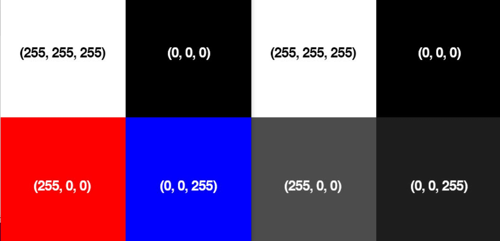

# Computer Vision
---

## Part 1: Image Basics
When we talk about the sizes of images, we generally talk about them in terms of the number of pixels the image possesses in the x(horizontal) or y(vertical) direction.  If the image is a color image, we also need to concern ourselves with the depth of the image as well.  Normally, each individual pixel is represented by the “color” or the “intensity” of light that appears in a given place in our image.

If we think of an image as a grid, each square in the grid contains a single pixel.

Most pixels are represented in two ways: grayscale and color. In a grayscale image, each pixel has a value between 0 and 255, where zero is corresponds to “black” and 255 being “white”. The values in between 0 and 255 are varying shades of gray, where values closer to 0 are darker and values closer 255 are lighter:


The grayscale gradient image in the figure above demonstrates darker pixels on the left-hand side and progressively lighter pixels on the right-hand side.

Color pixels, however, are normally represented in the RGB color space (this is where the term color-depth comes from)— one value for the Red component, one for Green, and one for Blue, leading to a total of 3 values per pixel:


Other color spaces exist, and ordering of the colors may differ as well, but let’s start with the common RGB system.  If we say the image is a 24-bit image, each of the three Red, Green, and Blue colors are represented by an integer in the range 0 to 255 (8-bits), which indicates how “much” of the color there is. Given that the pixel value only needs to be in the range [0, 255] we normally use an 8-bit unsigned integer to represent each color intensity.  We then combine these values into a RGB tuple in the form (red, green, blue) . This tuple represents our color.  For example:

- To construct a white color, we would fill each of the red, green, and blue buckets completely up, like this: (255, 255, 255) — since white is the presence of all color.
- Then, to create a black color, we would empty each of the buckets out: (0, 0, 0) — since black is the absence of color.
- To create a pure red color, we would fill up the red bucket (and only the red bucket) up completely: (255, 0, 0) .
- etc

Take a look at the following image to make this concept more clear:


For your reference, here are some common colors represented as RGB tuples:

- Black:  (0, 0, 0)
- White:  (255, 255, 255)
- Red:  (255, 0, 0)
- Green:  (0, 255, 0)
- Blue:  (0, 0, 255)
- Aqua:  (0, 255, 255)
- Fuchsia:  (255, 0, 255)
- Maroon:  (128, 0, 0)
- Navy:  (0, 0, 128)
- Olive:  (128, 128, 0)
- Purple:  (128, 0, 128)
- Teal:  (0, 128, 128)
- Yellow:  (255, 255, 0)

## Part 2: Coding with OpenCV-Python
It is time to build our first bit of code working with OpenCV.  Just like ROS, OpenCV is well supported by both Python and C++.  For simplicity, we will use Python throughout this course.  However, continue to recognize that if speed and efficiency become important, switching to a more robust language like C++ may become necessary.  To make use of OpenCV with Python, we need to import cv2.  The code below will simply load in the RGB figure above and print out the pixel values in each of the 4-quadrants.

First we need to import the OpenCV Python library, `cv2`:


```python
import cv2
```

Then we can load the image:


```python
image = cv2.imread("RGB_Tuple.JPG")
```

The `shape` characteristic of the image returns a tuple of the number of rows, columns, and channels (if the image is color):


```python
print("width: %d pixels" %(image.shape[1]))
print("height: %d pixels" % (image.shape[0]))
print("color channels: %d" % (image.shape[2]))
```

You an also access specific pixels within the image (the `image` variable is really just an array of pixel values) by the row and column coordinates. Each pixel values is an array of Blue, Green, and Red values.


```python
# print the BGR values of a pixel in the upper left of the image
print(image[10, 10, :])

# print the red value of a pixel in the bottom left of the image
print(image[700, 100, 2])
```

Fill in the code to do the following:


```python
# TODO: print BGR values of a pixel in the upper right of the image
print(image[ , , :])

# TODO: print BGR values of a pixel in the lower left of the image
print(image[ , , :])

# TODO: print blue value of a pixel in the lower right of the image
print(image[ , , ])
```

We can display the image as well.
> ⚠️ **WARNING:** To exit the image just press any key. **DO NOT** press the 'X' in the corner. If you do press the 'X' (smh) you will have to Restart & Clear the Kernel: in the Jupyter Notebook at the top menu bar select "Kernel" and "Restart & Clear Output".


```python
cv2.imshow("Loaded image", image)
cv2.waitKey(0)
cv2.destroyAllWindows() # close the image window
```

When executing the code above, there were two minor surprises. What do you think they were? Now lets take a look at additional functionality embedded within OpenCV.

Convert image to RGB and print the same pixel values. Remember that the image is already loaded within the `image` variable.


```python
# TODO: Convert image to RGB


# TODO: print the RGB values of a pixel in the upper left of the image


# TODO: print the red value of a pixel in the bottom left of the image


# TODO: print RGB values of a pixel in the upper right of the image


# TODO: print RGB values of a pixel in the lower left of the image


# TODO: print blue value of a pixel in the lower right of the image

```

Modify the code to convert to grayscale and print the same pixel values.


```python
# TODO: Convert image to Grayscale


# TODO: print the Grayscale values of a pixel in the upper left of the image


# TODO: print Grayscale values of a pixel in the upper right of the image


# TODO: print Grayscale values of a pixel in the lower left of the image

```

### Summary
These examples barely scratch the surface of what is possible with OpenCV. In the upcoming lessons we will learn a few more ways to manipulate images, but if you want to learn more you can either explore the [OpenCV-Python Source Documentation](https://docs.opencv.org/3.4/index.html) or the [OpenCV-Python Tutorial](https://docs.opencv.org/4.x/d6/d00/tutorial_py_root.html).

### Assignment
Scan the article on the [Histogram of Oriented Gradients (HOG)](https://arxiv.org/pdf/1406.2419.pdf) feature descriptor and be prepared to discuss.  I don't need you to understand the math, but you should be able to understand the advantages of the technique.

### Cleanup
In the Jupyter Notebook at the top menu bar select "Kernel" and "Restart & Clear Output". Shutdown the notebook server by typing `ctrl+c` within the terminal you ran `jupyter-notebook` in. Select 'y'.

## Part 3: Gradients

The objective of this portion of the lesson is for you to start the process of learning how to create custom object detectors in an image.  There are many techniques, but the one technique I am interested in applying first is what is known as Histogram of Oriented Gradients.  Before we can dig into the technique, we should first understand a bit about image gradients and contours.

By the end of today's lesson you will be able to: 
- Define what an image gradient is 
- Compute changes in direction of an input image 
- Define both gradient magnitude and gradient orientation 
- Use OpenCV to approximate image gradients 

The image gradient is one of the fundamental building blocks in computer vision image processing.   

We use gradients for detecting edges in images, which allows us to find contours and outlines of objects in images.  We use them as inputs for quantifying images through feature extraction — in fact, highly successful and well-known image descriptors such as Histogram of Oriented Gradients and SIFT are built upon image gradient representations. Gradient images are even used to construct saliency maps, which highlight the subjects of an image.  We use gradients all the time in computer vision and image processing.  I would go as far as to say they are one of the most important building blocks you will learn about in this module.  While they are not often discussed in detail since other more powerful and interesting methods build on top of them, we are going to take the time and discuss them in detail. 

As I mentioned in the introduction, image gradients are used as the basic building blocks in many computer vision and image processing applications.  However, the main application of image gradients lies within edge detection.  As the name suggests, edge detection is the process of finding edges in an image, which reveals structural information regarding the objects in an image.  Edges could therefore correspond to: 

- Boundaries of an object in an image. 
- Boundaries of shadowing or lighting conditions in an image. 
- Boundaries of “parts” within an object. 

As we mentioned in the previous portion of the lab, we will often work with grayscale images, because of the massive reduction in images.  OpenCV will convert to grayscale using the following conversion formula:

$Y = 0.299 R + 0.587 G + 0.114 B$

Let's see if that matches our expectations in the figure below:



The below figure is an image of edges being detected simply by looking for the contours in an image:


As you can see, all of the edges (or changes in contrast are clearly identified), but how did we do it?  Lets look at the math below, and then we will look at how simple the code is by taking advantage of OpenCV.

Formally, an image gradient is defined as a directional change in image intensity.  Or put more simply, at each pixel of the input (grayscale) image, a gradient measures the change in pixel intensity in a given direction. By estimating the direction or orientation along with the magnitude (i.e. how strong the change in direction is), we are able to detect regions of an image that look like edges.

Lets look at a blown up version of a basic pixel map.  Our goal here is to establish the basic framework for how we will eventually compute the gradient:


In the image above we essentially wish to examine the \(3 \times 3\) neighborhood surrounding the central pixel. Our x values run from left to right, and our y values from top to bottom. In order to compute any changes in direction we will need the north, south, east, and west pixels, which are marked on the above figure.

If we denote our input image as *I*, then we define the north, south, east, and west pixels using the following notation:

- North: $I(x, y - 1)$
- South: $I(x, y + 1)$
- East: $I(x + 1, y)$
- West: $I(x - 1, y)$

Again, these four values are critical in computing the changes in image intensity in both the x and y direction.

To demonstrate this, let us compute the vertical change or the y-change by taking the difference between the south and north pixels:

$G_{y} = I(x, y + 1) - I(x, y - 1)$

Similarly, we can compute the horizontal change or the x-change by taking the difference between the east and west pixels:

$G_{x} = I(x + 1, y) - I(x - 1, y)$

Awesome — so now we have $G_{x}$ and $G_{y}$, which represent the change in image intensity for the central pixel in both the x and y direction.  Lets look at a relatively intuitive example at first without all the math.


On the left we have a $3 \times 3$ region of an image where the top half of the image is white and the bottom half of the image is black. The gradient orientation is thus equal to $\theta=-90^{\circ}$

And on the right we have another $3 \times 3$ neighborhood of an image, where the upper triangular region is white and the lower triangular region is black. Here we can see the change in direction is equal to $\theta=-45^{\circ}$.  While these two examples are both relatively easy to understand, lets use our knowledge of the Pythagorean theorem to actually compute the magnitude and orientation of the gradient with actual values now.


Inspecting the triangle in the above figure you can see that the gradient magnitude G is the hypotenuse of the triangle. Therefore, all we need to do is apply the Pythagorean theorem and we will end up with the gradient magnitude:

$G = \sqrt{G_{x}^{2} + G_{y}^{2}}$

The gradient orientation can then be given as the ratio of $G_{y}$ to $G_{x}$. We can use the $tan^{-1}$ to compute the gradient orientation,

$\theta = tan^{-1}(\frac{G_{y}}{G_{x}}) \times (\frac{180}{\pi})$

We converted to degrees by multiplying by the ratio of $180/\pi$.  Lets now add pixel intensity values and put this to the test.


In the above image we have an image where the upper-third is white and the bottom two-thirds is black. Using the equations for $G_{x}$ and $G_{y}$, we arrive at:

$G_{x} = $

and

$G_{y} = $

Plugging these values into our gradient magnitude equation we get:

$G = $

As for our gradient orientation:

$\theta = $

Now you try with the following example:


$G_{x} = $

and

$G_{y} = $

Plugging these values into our gradient magnitude equation we get:

$G = $

As for our gradient orientation:

$\theta = $

Now that you know how to compute both the orientation and the magnitude of the gradients, you essentially have the most basic building block established for computing the necessary information for HOG w/ SVM.  Additionally, you can use the following code to compute very effective contours in images. 

Fortunately, in practice we don't need to do any of the math above.  Instead we can use what is known as the Sobel Kernel to compute the values for $G_{x}$ and $G_{y}$.  OpenCV and numpy have functionality built in that allow us to do all of this very quickly.  

>  To exit the image just press any key. **DO NOT** press the 'X' in the corner. If you do press the 'X' (smh) you will have to Restart & Clear the Kernel: in the Jupyter Notebook at the top menu bar select "Kernel" and "Restart & Clear Output".


```python
import cv2
import numpy as np
```


```python
#load the image
image=cv2.imread("RGB_Tuple.JPG")
gray = cv2.cvtColor(image, cv2.COLOR_BGR2GRAY)
```


```python
#Show the original image along with the grayscale image
cv2.imshow("Original image", image)
cv2.imshow("Grayscale Image", gray)

# Lets now compute the gradients along the X and Y axis, respectively
gX = cv2.Sobel(gray,cv2.CV_64F,1,0)
gY = cv2.Sobel(gray,cv2.CV_64F,0,1)

# the `gX` and `gY` images are now of the floating point data type,
# so we need to take care to convert them back to an unsigned 8-bit
# integer representation so other OpenCV functions can utilize them
gX = cv2.convertScaleAbs(gX)
gY = cv2.convertScaleAbs(gY)

# combine the sobel X and Y representations into a single image
sobelCombined = cv2.addWeighted(gX, 0.5, gY, 0.5, 0)
cv2.imshow("Gradient Image", sobelCombined)
cv2.waitKey(0)
cv2.destroyAllWindows() # close the image window
```

### Summary
Gradients are one important tool used in object detection. Next lesson we will learn how to apply gradients using the Histogram of Oriented Gradients to train an object detector.

### Assignment
Watch the following video on [Histogram of Oriented Gradients](https://youtube.com/watch?v=4ESLTAd3IOM).

### Cleanup
In the Jupyter Notebook at the top menu bar select "Kernel" and "Restart & Clear Output". Shutdown the notebook server by typing `ctrl+c` within the terminal you ran `jupyter-notebook` in. Select 'y'.

## Part 4: Histogram of Oriented Gradients (HOG) Features

The objective of this portion of the lesson is to demonstrate the functionality of the HOG with SVM (Support Vector Machine) algorithm for object detection.  By this point, we should all be well aware of what a histogram is.  The application of the histogram for the HOG feature extraction is to further simplify the tested image to enable our computer to rapidly and accurately identify the presence of an object within the image.  
Instead of using each individual gradient direction of each individual pixel of an image, we group the pixels into small cells. For each cell, we compute all the gradient directions and group them into a number of orientation bins. We sum up the gradient magnitude in each sample. So stronger gradients contribute more weight to their bins, and effects of small random orientations due to noise is reduced. Doing this for all cells gives us a representation of the structure of the image. The HOG features keep the representation of an object distinct but also allow for some variations in shape.  For example, lets consider an object detector for a car, see the below figure.


Comparing each individual pixel of this training image with another test image would not only be time consuming, but it would also be highly subject to noise.  As previously mentioned, the HOG feature will consider a block of pixels.  The size of this block is variable and will naturally impact both accuracy and speed of execution for the algorithm.  Once the block size is determined, the gradient for each pixel within the block is computed.  Once the gradients are computed for a block, the entire cell can then be represented by this histogram.  Not only does this reduce the amount of data to compare with a test image, but it also reduces the impacts of noise in the image and measurements.  


Now that we have an understanding of the HOG features, lets use tools embedded within OpenCV and Dlib to build our first detector for a stop sign.  But first we need to download a pre-created repository of test and training data.  Remember, we won't use our training data to test the effectiveness of the algorithm.  Of course the algorithm will work effectively on the training data.  Our hope is that we can create a large enough sampling of test data that we can have a highly effective detector that is robust against new images.

### Building a detector using HOG features
Download the example demo into the `my_scripts` folder you created earlier in the semester. It should be located under `~/master_ws/src/ece387_curriculum/`.

```bash
roscd ece387_curriculum/my_scripts
git clone git@github.com:ECE495/HOG_Demo.git
cd HOG_Demo
```

Take a look at what is contained within the repo.  Essentially you have both a training data folder and a test folder.  We will now use a tool called **imglab** to annotate the images for building our detector.

Browse to the [imglab tool](https://imglab.in/) and select **"UMM, MAYBE NEXT TIME!"**.

In the bottom left of the site, select the load button and browse to the training folder:


Select the first stop sign and the **"Rectangle"** tool. 


Highlight the border of the stop sign: drag-and-draw a bounding rectangle, ensuring to **only** select the stop sign and to select all examples of the object in the image.

> 📝️ **NOTE:** It is important to label all examples of objects in an image; otherwise, Dlib will implicitly assume that regions not labeled are regions that should not be detected (i.e., hard-negative mining applied during extraction time).

You can select a bounding box and hit the delete key to remove it.

If you press `alt+left/right arrow` you can navigate through images in the slider and repeat highlighting the objects.

Once all stop signs are complete hit `ctrl+e` to save the annotations (bounding box information) as a **"Dlib XML"** file within the `training` folder using a descriptive name such as `stop_annotations.xml`.


We now need to create the code to build the detector based on our annotated training data.

```bash
cd ~/master_ws/src/ece387_curriculum/my_scripts/HOG_Demo
touch trainDetector.py
```

Now open this in your favorite editor to add the following code.  I have built into the code the ability to provide command line arguments.  This will make the code a bit more flexible such that you don't need to recreate it in the future if you want to reuse if for another project.  You will provide two arguments at runtime.  First you need to tell the program where the .xml file is.  Second, you will state where you want to put the detector that you create... the detector should have a .svm extension.

```python
# import the necessary packages
from __future__ import print_function
import argparse
import dlib

# construct the argument parser and parse the arguments
ap = argparse.ArgumentParser()
ap.add_argument("-x", "--xml", required=True, help="path to input XML file")
ap.add_argument("-d", "--detector", required=True, help="path to output detector")
args = vars(ap.parse_args())

# grab the default training options for the HOG + Linear SVM detector, then
# train the detector -- in practice, the `C` parameter can be adjusted...
# feel free to research and see if you can improve
print("[INFO] training detector...")
options = dlib.simple_object_detector_training_options()
options.C = 1.0
options.num_threads = 4
options.be_verbose = True
dlib.train_simple_object_detector(args["xml"], args["detector"], options)

# show the training accuracy
print("[INFO] training accuracy: {}".format(
	dlib.test_simple_object_detector(args["xml"], args["detector"])))
	
# load the detector and visualize the HOG filter
detector = dlib.simple_object_detector(args["detector"])
win = dlib.image_window()
win.set_image(detector)
dlib.hit_enter_to_continue()
```

Once you have the code entered, you can run it with the following command.  Remember, you need to provide two command line arguments:

```bash
roscd ece387_curriculum/my_scripts/HOG_Demo
python3 trainDetector.py --xml training/stop_annotations.xml --detector training/stop_detector.svm
```

You may get a few errors pop up during execution based on your choice for bounding boxes.  Make sure you address those errors before continuing.  If everything executed correctly, you should ultimately see a picture of the HOG feature you designed.  

### Testing a detector
Now it is time to build our code to test the detector.  The following code will make use of the imutils library as well.

You may get a few errors pop up during execution based on your choice for bounding boxes.  Make sure you address those errors before continuing.  If everything executed correctly, you should ultimately see a picture of the HOG feature you designed.  

Now it is time to build our code to test the detector.

```bash
roscd ece387_curriculum/my_scripts/HOG_Demo
touch testDetector.py
```

Again, use your preferred editor to enter the code below: 

```python
# import the necessary packages
from imutils import paths
import argparse
import dlib
import cv2

# construct the argument parser and parse the arguments
ap = argparse.ArgumentParser()
ap.add_argument("-d", "--detector", required=True, help="Path to trained object detector")
ap.add_argument("-t", "--testing", required=True, help="Path to directory of testing images")
args = vars(ap.parse_args())

# load the detector
detector = dlib.simple_object_detector(args["detector"])

# loop over the testing images
for testingPath in paths.list_images(args["testing"]):
	# load the image and make predictions
	image = cv2.imread(testingPath)
	boxes = detector(cv2.cvtColor(image, cv2.COLOR_BGR2RGB))
	
	# loop over the bounding boxes and draw them
	for b in boxes:
		(x, y, w, h) = (b.left(), b.top(), b.right(), b.bottom())
		cv2.rectangle(image, (x, y), (w, h), (0, 255, 0), 2)
		
	# show the image
	cv2.imshow("Image", image)
	cv2.waitKey(0)
```

Run the test detector:

```bash
roscd ece387_curriculum/my_scripts/HOG_Demo
python3 testDetector.py --detector training/stop_detector.svm --testing test
```

OK, so how did you do? What surprises did you have? What might you consider to improve the detector?

### Summary
You have now trained and tested your first detector! In the future you will train a new detector using the camera on your robot and a real stop sign. This will be used in your final project to detect and react to stop signs in the wild!

### Assignment
Research Dlib's simple object detector, and see how you might want to tune the options to improve the performance.

### Cleanup
In the Jupyter Notebook at the top menu bar select "Kernel" and "Restart & Clear Output". Shutdown the notebook server by typing `ctrl+c` within the terminal you ran `jupyter-notebook` in. Select 'y'.

## Part 5: ROS and Image Capture
ROS provides a number of tools to interact with a commercial-off-the-shelf camera such as the USB camera connected to your robot. The primary tool we will use is the [usb_cam](http://wiki.ros.org/usb_cam) package which is already installed on your robot.

Let's create a **lab4** package on the **Master** we can use to start developing a launch file to run our computer vision tools.

In a terminal create a **lab4** package, `launch` folder, and `lab4.launch` file:

```bash
cd ~/master_ws/src/ece387_robot_spring202X-USERNAME/
catkin_create_pkg lab4 rospy sensor_msgs std_msgs cv_bridge apriltag_ros
cd lab4
mkdir launch
cd launch
touch lab4.launch
```

Make and source your workspace.

### Launch File - USB Cam

Edit the `lab4.launch` file to call the **usb_cam_node** on the robot which will automatically connect to the camera and publish the video over a topic.

```xml
<launch>
    
    <machine
        name="robot0"
        address="robot0"
        default="true"
        user="pi"
    />

    <!-- usb camera -->
    <node machine="robot0" name="usb_cam" pkg="usb_cam" type="usb_cam_node" output="screen" >
        <param name="video_device" value="/dev/video0" />
        <param name="image_width" value="640" />
        <param name="image_height" value="480" />
        <param name="pixel_format" value="yuyv" />
        <param name="camera_frame_id" value="usb_cam" />
        <param name="io_method" value="mmap"/>
  </node>
    
</launch>
```

Save and exit.

Ensure **roscore** is running on the **Master**.

Run the **usb_cam** node on the **Robot** using the **lab4** launch file.

Open a terminal on the **Master** and view the topics created by the node.

The primary topic we will look at is */usb_cam/image_raw*. What type of message is sent over this topic? Take note as we will use this in the lab!

Let's display the video using the **image_view** tool on the **Master**.

```bash
rostopic list
rosrun rqt_image_view rqt_image_view
```
Ensure the `/usb_cam/image_raw` topic is selected.

### Calibrate USB Camera

A camera must first be calibrated to utilize computer vision based tasks. Otherwise, there is no reference for how large objects are in regards to the camera frame. The [ROS Calibration Tool](http://wiki.ros.org/camera_calibration) creates a calibration file that is then used by other ROS packages to enable size and distance calculations. The **camera_calibration** package utilizes OpenCV camera calibration to allow easy calibration of monocular or stereo cameras using a checkerboard calibration target. The complete guide can be found on the [Camera Calibration Tutorial](http://wiki.ros.org/camera_calibration/Tutorials/MonocularCalibration).

Connect to the camera using the **usb_cam** node:

```bash
roslaunch lab4 lab4.launch
```

Run the camera calibrate package with the correct parameters (even though the checkerboard says it is a 9x6 board with 3.0 cm squares it is actually a 8x5 board with 2.7 cm squares - the size the calibration tool uses is actually the interior vertex points, not the squares).

Open a new terminal on the **Master** and run the folowing:

```bash
rosrun camera_calibration cameracalibrator.py --size 8x5 --square 0.027 image:=/usb_cam/image_raw camera:=/usb_cam
```
You should see a window open that looks like this:


In order to get a good calibration you will need to move the checkerboard around in the camera frame such that:

- checkerboard on the camera's left, right, top and bottom of field of view
    - X bar - left/right in field of view
    - Y bar - top/bottom in field of view
    - Size bar - toward/away and tilt from the 
- checkerboard filling the whole field of view
- checkerboard tilted to the left, right, top and bottom (Skew)


As you move the checkerboard around you will see three bars on the calibration sidebar increase in length. 

When the CALIBRATE button lights, you have enough data for calibration and can click CALIBRATE to see the results. Calibration can take a couple minutes. The windows might be greyed out but just wait, it is working.


When complete, select the save button and then commit.

Browse to the location of the calibration data, extract, and move to the appropriate ROS folder on the robot:

```bash
cd /tmp
tar xf calibrationdata.tar.gz
scp ost.yaml pi@robotX:/home/pi/.ros/camera_info/head_camera.yaml
```

Kill the `lab4.launch`. 

Create a secure shell to the robot and edit the calibration data and replace "narrow\_stero" with "head\_camera":

```bash
ssh pi@robotX
nano /home/pi/.ros/camera_info/head_camera.yaml
```

Rerun the `lab4.launch` file on the robot. You should see the camera feed reopen and see no errors in the command line (you may need to unplug and plug your camera back in).

### Checkpoint
Show an instructor the working camera feed and that the **usb_cam** node was able to open the camera calibration file.

### Summary
You now are able to connect to a USB camera using ROS, display the image provided by the node, and have a calibration file that ROS can use to identify the size of objects in the frame.

### Cleanup
Kill all rosnodes and roscore!

## Part 6: Fiducial Markers

In this lesson we will learn how fiducial markers are used in image processing. Specifically, we will utilize ROS tools to identify different [April Tags](https://april.eecs.umich.edu/papers/details.php?name=olson2011tags) and use the 3D position and orientation to determine the robot's distance from an object.

A fiducial marker is an artificial feature used in creating controllable experiments, ground truthing, and in simplifying the development of systems where perception is not the central objective. A few examples of fiducial markers include ArUco Markers, AprilTags, and QR codes. Each of these different tags hold information such as an ID or, in the case of QR codes, websites, messages, and etc. We will primarily be focusing on AprilTags as there is a very robust ROS package already built. This library identifies AprilTags and will provide information about the tags size, distance, and orientation.

### AprilTag ROS
Browse to the AprilTag_ROS package on the **Master** and edit the config file:

```bash
roscd apriltag_ros/config
sudo nano tags.yaml
```

This is where you provide the package with information about the tags it should identify. You should have gotten tags 0-3. Each of these tags is $.165 m$ wide and should have a corresponding name: "tag_0" (in the final project, you might want to change these names as we will be providing you commands that correspond to each tag). In the `tags.yaml` file, add a line for each tag under "standalone tags" (replace ... with last two tags):

```python
standalone_tags:
  [
  	{id: 0, size: .165, name: tag_0},
  	{id: 1, size: .165, name: tag_1},
  	...
  ]
```

Repeat these steps on the **Robot**.

### Launch File - Apriltag_Ros

Edit the `lab4.launch` file on the **Master**, calling the `continuous_detection` node provided by the **apriltag_ros** package. We need to set the arguments to the values provided by the `usb_cam` node:

Add the following arguments and parameters to the top of the launch file:

```xml
<arg name="launch_prefix" default="" />
<arg name="node_namespace" default="apriltag_ros_continuous_node" />
<arg name="camera_name" default="/usb_cam" />
<arg name="image_topic" default="image_raw" />

<!-- Set parameters -->
<rosparam command="load" file="$(find apriltag_ros)/config/settings.yaml" ns="$(arg node_namespace)" />
<rosparam command="load" file="$(find apriltag_ros)/config/tags.yaml" ns="$(arg node_namespace)" />
```

Add the apriltag node in the remote section:


```xml
<!-- apriltag_ros -->
<node machine="robot0" pkg="apriltag_ros" type="apriltag_ros_continuous_node" name="$(arg node_namespace)" clear_params="true" output="screen" launch-prefix="$(arg launch_prefix)" >
<!-- Remap topics from those used in code to those on the ROS network -->
<remap from="image_rect" to="$(arg camera_name)/$(arg image_topic)" />
<remap from="camera_info" to="$(arg camera_name)/camera_info" />

<param name="publish_tag_detections_image" type="bool" value="true" />      <!-- default: false -->
</node>

```

Save and exit.

Launch the `lab4.launch` file. 

In a terminal on the master open the **rqt_image_view** node (`rosrun rqt_image_view rqt_image_view`) and select the *tag_detections_image* topic. If you hold up each tag, you should see a yellow box highlight the tag with an id in the middle of the tag.

In another terminal on the master echo the topic `tag_detections`. What information do you see? Will the apriltag_ros node identify only one tag at a time? Which value do you think we would use to determine distance from the tag? What kind of message is this? What package does this message come from?

### Checkpoint
Show an instructor that the **apriltag_ros** can identify tags and provides position data.

### Summary
You now have the ability to identify AprilTags and because you have a calibrated camera, you can detect the size, orientation, and distance of a tag.

### Cleanup
Kill all rosnodes and roscore!
